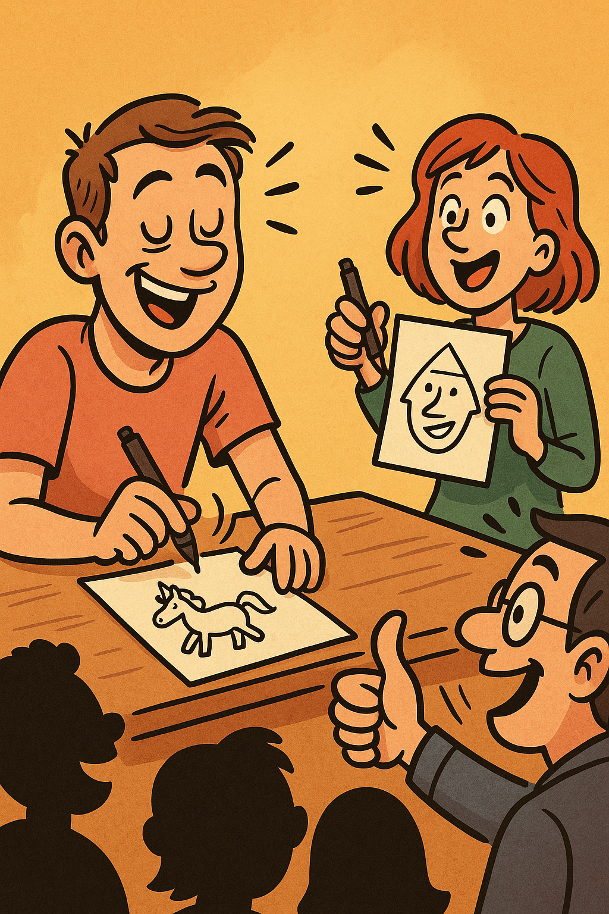

# 🎉 Level 30 Erreicht - David's Geburtstags-Party-App

Eine interaktive Flask-Web-Anwendung für David's 30. Geburtstag mit 6 spannenden Party-Spielen, Live-Abstimmungen und einem Punktesystem.


## 📖 Über das Projekt

Diese Web-App wurde speziell für David's 30. Geburtstagsparty entwickelt. Sie ermöglicht es dem Gastgeber (Moderator), verschiedene interaktive Spiele auf einem Laptop/Beamer zu präsentieren, während die Gäste über ihre Smartphones in Echtzeit abstimmen können, wer jedes Spiel gewinnt.

### ✨ Features

- **6 verschiedene Party-Spiele** mit unterschiedlichen Punktwerten
- **Live-Abstimmungssystem** - Gäste stimmen über ihre Smartphones ab
- **Echtzeit-Scoreboard** - Zeigt die aktuellen Punktestände von David vs. Gäste
- **Gewinnspiel-Feature** - Gäste können Bilder hochladen und abstimmen
- **"Was kostet der Spaß?"** - eBay-Kleinanzeigen Schätzspiel
- **Responsive Design** - Optimiert für Desktop (Moderator) und Mobile (Gäste)
- **Keine Datenbank erforderlich** - Einfaches In-Memory-System

## 🎮 Die Spiele

### Spiel 1: „Lets Dance" 🕺 (6 Punkte)


**Das große Tanzduell**
- David tritt gegen einen Gast an
- Beide tanzen zu einem ausgewählten Song
- Das Publikum entscheidet den Sieger durch Abstimmung
- **Gewinn:** 6 Punkte pro Runde

---

### Spiel 2: „Lach doch mal!" 😆 (5 Punkte)


**Die ultimative Publikum-Lach-Challenge**
- David wählt drei Gäste aus
- Er hat 60 Sekunden Zeit, sie zum Lachen zu bringen
- Mindestens zwei müssen lachen UND das Publikum muss zustimmen
- David darf selbst nicht lachen
- **Gewinn:** 5 Punkte pro Runde

---

### Spiel 3: „Blind Artist" 🎨 (4 Punkte)


**Zeichne, was ich sage! - Team Battle**
- David wählt drei Gäste: einen für sein Team, zwei für das Gegnerteam
- Eine Person pro Team hat die Augen verbunden und zeichnet
- Die andere Person muss den Begriff erraten
- Wer zuerst richtig rät, gewinnt
- **Gewinn:** 4 Punkte pro Runde

---

### Spiel 4: „Wissensduell" 🎯 (3 Punkte)


**David vs. Publikum - Das große Quiz-Battle**
- David wählt ein 3er-Team aus dem Publikum
- Es werden Quiz- und Wissensfragen gestellt
- Beide Teams beraten sich und geben ihre Antworten
- Wer mehr Fragen richtig beantwortet, gewinnt
- **Gewinn:** 3 Punkte pro Runde

---

### Spiel 5: „Den Song kenn ich" 🎵 (2 Punkte)


**Das blitzschnelle Song-Erkennungsduell**
- David tritt gegen einen zufälligen Gast an
- Ein Song wird angespielt
- Wer als Erstes den Songtitel errät, gewinnt
- Es werden drei Runden gespielt
- **Gewinn:** 2 Punkte pro Runde

---

### Spiel 6: „Was kostet der Spaß?" 🛒 (1 Punkt)


**Das große Kleinanzeigen-Schätzduell**
- David tritt gegen einen Gast an
- Ein echtes eBay-Kleinanzeigen-Inserat wird angezeigt
- Beide müssen den Preis schätzen
- Wer näher dran ist, gewinnt die Runde
- **Gewinn:** 1 Punkt pro Runde

---

## 🏆 Gewinn-System

Am Ende der Party werden die Punkte zusammengezählt, und David erhält je nach erreichter Punktzahl unterschiedliche Preise:

- **0–19 Punkte**: Die traurigste Version – eine Zahnbürste 🪥
- **20–30 Punkte**: Fortgeschrittenes Fegen – ein Kehrblech 🧹
- **31–40 Punkte**: Semi-Profi – ein kleiner Handfeger 🧹
- **41+ Punkte**: Endboss-Modus – der große Feger! 🧹✨

## 🚀 Installation

### Voraussetzungen

- Python 3.7 oder höher
- pip (Python Package Manager)

### Schritt 1: Repository klonen

```bash
git clone https://github.com/KevinThalmann222/Level_30_erreicht.git
cd Level_30_erreicht
```

### Schritt 2: Abhängigkeiten installieren

```bash
pip install -r requirements.txt
```

### Schritt 3: Anwendung starten

**Entwicklungsmodus:**
```bash
python app.py
```

Die App läuft dann auf `http://localhost:5000`

**Produktionsmodus:**
```bash
gunicorn -w 4 -b 0.0.0.0:5000 app:app
```

## 📱 Verwendung

### Für den Moderator (Laptop/Beamer):

1. Starte die Anwendung auf deinem Laptop
2. Öffne `http://localhost:5000` oder deine lokale IP-Adresse
3. Navigiere durch die Spiele und zeige sie auf dem Beamer
4. Verwalte das Scoreboard und aktualisiere Punkte nach jedem Spiel

### Für die Gäste (Smartphones):

1. Verbinde dich mit dem gleichen WiFi-Netzwerk
2. Öffne die IP-Adresse des Moderator-Laptops in deinem Browser
   - z.B. `http://192.168.1.100:5000`
3. Stimme bei jedem Spiel ab, wer gewonnen hat
4. Sieh die Live-Ergebnisse und das Scoreboard

## 🛠️ Technische Details

### Technologie-Stack

- **Backend:** Flask (Python Web Framework)
- **Frontend:** HTML5, CSS3, JavaScript
- **Styling:** Bootstrap + Custom CSS
- **Session Management:** Flask Sessions
- **File Handling:** Werkzeug

### Projektstruktur

```
Level_30_erreicht/
├── app.py                    # Haupt-Flask-Anwendung
├── wsgi.py                   # WSGI Entry Point für Deployment
├── requirements.txt          # Python-Abhängigkeiten
├── requirements-prod.txt     # Produktions-Abhängigkeiten
├── Rules.md                  # Detaillierte Spielregeln
├── static/                   # Statische Dateien
│   ├── david.png            # David's Bild
│   ├── spiel1.png - spiel6.png  # Spiel-Bilder
│   ├── style.css            # Hauptstylesheet
│   ├── ebay/                # eBay-Kleinanzeigen-Bilder
│   └── uploads/             # Hochgeladene Gewinnspiel-Bilder
├── templates/               # HTML-Templates
│   ├── base.html           # Basis-Template
│   ├── index.html          # Startseite
│   ├── spieluebersicht.html  # Spielübersicht
│   ├── spiel.html          # Einzelnes Spiel
│   ├── was_kostet_der_spass.html  # eBay-Spiel
│   ├── gewinnspiel.html    # Gewinnspiel
│   ├── scoreboard.html     # Punktestand
│   └── 404.html            # Fehlerseite
└── pptx_extracted/         # Extrahierte PowerPoint-Dateien
```

### Hauptfunktionen in `app.py`

- **Abstimmungssystem:** Tracking von Stimmen pro Spiel mit Duplikatsschutz
- **Scoreboard:** Dynamische Punkteverwaltung für David vs. Gäste
- **Gewinnspiel:** Bild-Upload und Like-System
- **eBay-Spiel:** Preisschätzung mit automatischem Bildwechsel
- **Session-Management:** Sichere Benutzer-Sessions

## 🌐 Deployment

### Option 1: Lokales Netzwerk (Empfohlen für Partys)

1. Stelle sicher, dass dein Laptop und alle Gäste-Smartphones im gleichen WiFi sind
2. Finde deine lokale IP-Adresse:
   - Windows: `ipconfig`
   - Mac/Linux: `ifconfig` oder `ip addr`
3. Starte die App mit `python app.py`
4. Gäste können über `http://[DEINE-IP]:5000` zugreifen

### Option 2: PythonAnywhere (Online-Hosting)

Siehe [PYTHONANYWHERE_DEPLOYMENT.md](PYTHONANYWHERE_DEPLOYMENT.md) für detaillierte Anweisungen.

### Option 3: Heroku/Railway/Render

Siehe [DEPLOYMENT_GUIDE.md](DEPLOYMENT_GUIDE.md) für weitere Deployment-Optionen.

## 📄 Zusätzliche Dokumentation

- **[Rules.md](Rules.md)** - Vollständige und detaillierte Spielregeln
- **[SETUP_GUIDE.md](SETUP_GUIDE.md)** - Ausführliche Setup-Anleitung
- **[DEPLOYMENT_GUIDE.md](DEPLOYMENT_GUIDE.md)** - Deployment-Optionen
- **[PYTHONANYWHERE_DEPLOYMENT.md](PYTHONANYWHERE_DEPLOYMENT.md)** - PythonAnywhere-Spezifisch
- **[MOBILE_GUIDE.md](MOBILE_GUIDE.md)** - Mobile Optimierungen
- **[DESIGN_CHANGES.md](DESIGN_CHANGES.md)** - Design-Änderungen
- **[WINNER_FEATURE.md](WINNER_FEATURE.md)** - Gewinner-Feature-Dokumentation

## 🎨 Screenshots

### Startseite
Die Landing Page begrüßt die Gäste mit einem modernen Design und einfacher Navigation.

### Spielübersicht
Alle 6 Spiele werden mit Bildern, Beschreibungen und Punktwerten dargestellt.

### Live-Abstimmung
Gäste können in Echtzeit abstimmen, die Ergebnisse werden sofort aktualisiert.

### Scoreboard
Zeigt den aktuellen Punktestand zwischen David und den Gästen mit großen, gut lesbaren Zahlen.

### Gewinnspiel
Gäste können Bilder hochladen und für ihre Favoriten abstimmen.

## 🔒 Sicherheit

- **Session-Cookies:** Sichere HTTP-Only Cookies
- **File Upload Validation:** Nur erlaubte Bildformate (JPG, PNG, GIF)
- **File Size Limits:** Maximale Upload-Größe von 5 MB
- **Input Sanitization:** Werkzeug's secure_filename für Uploads
- **Environment Variables:** Sensible Daten in `.env` Dateien

## 🤝 Beitragen

Dies ist ein persönliches Geburtstagsparty-Projekt, aber Vorschläge und Verbesserungen sind willkommen!

## 📝 Lizenz

Dieses Projekt wurde für private Zwecke erstellt. Bei Verwendung bitte Credits geben.

## 👨‍💻 Autor

Erstellt für David's 30. Geburtstag 🎂

## 🎊 Verwendete Spiele-Ideen

Die Spiele wurden inspiriert von klassischen Party-Spielen:
- Tanzwettbewerbe
- Improv-Comedy-Challenges
- Blind-Drawing-Spiele
- Quiz-Battles
- Musik-Ratespiele
- Preis-Schätzspiele

---

**Viel Spaß bei der Party! 🎉🎂🎈**
